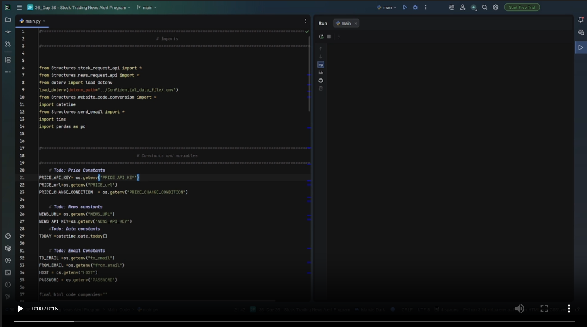
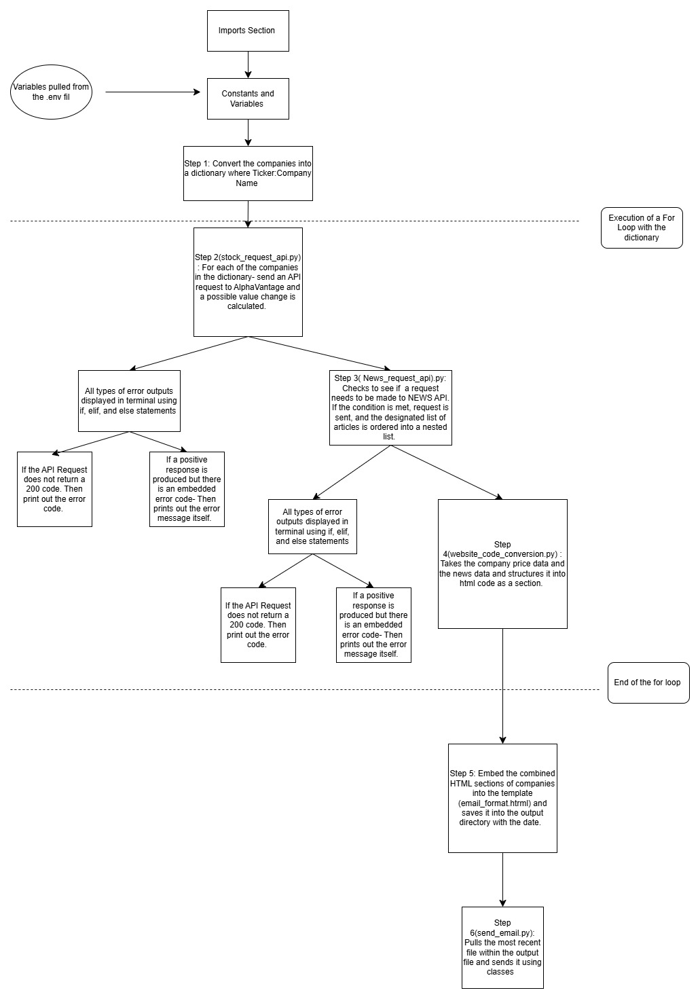

# Market News Alert System

### <u>Overview</u> 
The Market News Alert System monitors key financial indicators using the AlphaVantage API and detects significant price movements.
When a price crosses a predefined threshold, the system automatically retrieves relevant news articles and sends a structured email alert summarising the event. 
This allows users to stay informed about market‑moving developments in real time.

### <u>Who is it for?</u>
- Individual investors: Tracking certain stocks and want to check why there is a price movement without manually checking the news. 
- Traders : Traders who requres fast information to make decisions 
- Financial analysts/ Economic Analyst: Inidivuals who monitor multiple variables and need a lightweight system to sruface relanat news. 
- Anyone who wants automated email alerts.

### <u>Demo</u> 
                                 Terminal Output with print statements       
### Demo Video  
[](Multimedia/Output_Video.mp4)

                                             Email Output


                    
* Please note: Can apply these outputs for multiple companies in the same format. 

### <u>Please Note</u>
- Rate limit is handled using a 0.5 second pause using the ``` time.sleep()``` so function. 
- Currently the errors are separated using if/elif/else statements and printed into the terminal.

### <u>Installation</u>

Follow these steps to set up the Market Alert System on your machine:
1) Clone the repository: 
```bash 
git clone {Name of the repostory I create}.git
cd repository
```

2) Create a virtual environment 

```
# Create the .venv file ( Powershell)

python -m venv .venv 

# Activate the file 
.venv\Scripts\activate
```
3) Create a .env file in the Confidential_Data directory
4) State these parameters within the .env file: 
```
# Alpha Vantage
PRICE_API_KEY=...
PRICE_URL=https://www.alphavantage.co/query

# News API
NEWS_API_
NEWS_URL=https://newsapi.org/v2/everything?

# Email
TO_EMAIL=
PASSWORD=
HOST=smtp.gmail.com
FROM_EMAIL=

# Companies to track
COMPANIES=

# Price change threshold
PRICE_CHANGE_CONDITION=
```
5) Run the script in main.py


### <u>Architecture</u>
         Flowchart showing how the supporting modules integrate into main.pY




### <u>Folder Structure</u>

```
MARKET_ALERT_SYSTEM/                        # Root project folder
│
├── Main Code/                              # Main program entry point
│   │                             
│   └── main.py                                 ## Runs the full market alert system
│
├── Structures/                             # All helper modules (APIs, email, formatting)
│   │
│   ├── stock_request_api.py                    ## Gets live stock prices
│   ├── news_request_api.py                     ## Gets financial news
│   ├── send_email.py                           ## Sends alert emails
│   ├── website_code_conversion.py              ## Converts data for website/email display
│   └── email_format.html                       ## HTML template for alert emails
│
├── Companies_List/                         # Input data for companies 
│   │
│   ├── Companies_list.csv                      ## List of companies that are active.
│   └── list_of_stocks_api.py                   ## Converts company list into API symbols
│
├── Confidential_data/                      # Private keys & secrets
│   │
│   └── .env                                    ## API keys and email credentials
│
├── Output_Emails/                          ## Generated email alerts
│   └── output_format_YYYY-MM-DD.html
│
├── Multimedia/                             ## Images & videos for documentation
│   ├── Architecture_Flowchart.jpg
│   ├── Output files.mp4
│   └── Output_email.jpg
│
├── Documentation/                          # Project notes.
│   └── Steps.txt
│
├── .gitignore                              # Prevents secrets and cache from being uploaded
├── README.md                               # Project overview
└── .venv/                                  # Python virtual environment

```

    


